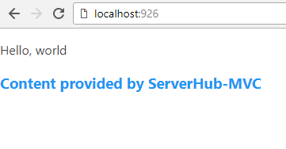

# ServerHub


Project introductions, documents and tutorials, see [ServerHub](https://serverhuborg.github.io/serverhub-mvc/index.html).

我们为中国大陆，中国香港、澳门和中国台湾和其他国家地区使用简体中文的开发者提供了[中文说明文档](doc/README.cn.md)。

For developers using simplified Chinese in China (including Mainland China, Hongkong and Macau Special Administrative Regions, and Taiwan, Province of China) and any other countries or regions, we provide [Simplified Chinese version of README](doc/README.cn.md) as well.

**ServerHub** is a collection of both Node.js framework and its CLI tool.

ServerHub MVC ([serverhub-mvc](https://www.npmjs.com/package/serverhub-mvc)) is a fast and light MVC web server framework that runs on Nodejs.

For details of the CLI tool, checkout [serverhub-cli](https://www.npmjs.com/package/serverhub-cli) or [serverhub-cli](https://github.com/ServerHubOrg/serverhub-cli) under my public repositories.

## Latest Update

Module style of ServerHub controllers now supported. You can import your own libraries in your controllers now. Legacy ways of scripting controllers will also be supported. But a little workaround should be taken into consideration.

Detailed update could be found on CHANGELOG.md (English only).

## What Can ServerHub Do

Currently, ServerHub support custom routing, view binding and controller registering.

Here is how the example workspace directory looks like (you can use `serverhub-cli init [project-name]` with [serverhub-cli](https://github.com/ServerHubOrg/serverhub-cli) to get a template provided by Yuyang Mao)

```plain
demo_directory/
 |- controller/
 |   |- home.shc.js // ".shc" is required if you want to use module style controller syntax provided since v1.0.3
 |- model/
 |   |- home.json
 |- view/
 |   |- home.html
 |- www/
 |   |- global.css
 |   |- global.js
 |- app.js
```

Then, run

```bash
node app.js
```

And the server started (It runs on port 926 in default, which is my BF's birthday). Go to your browser and checkout 'localhost:926', then you can see:



The content comes from default route rule: `/home/index/`. The word 'world' is defined in model file `home.json` and rendered by `home.js` controller. The sentence in blue is injected by script file `global.js` under `www/`.

## Install

```bash
npm i --save serverhub-mvc
```

or if you want to get a template, run

```bash
npm i -g serverhub-cli
cd path/to/you/workspace/
serverhub-cli init [project-name] # This will generate a new directory for you project.
```

## Usage

In your entry script:

```js
const serverhub = require('serverhub-mvc');

serverhub.Run({
    BaseDir: __dirname // BaseDir is required.
});
```

`Run()` method has two parameters (the second one is not required since v0.0.91):

1. config

    The config file defines base directory of the server, which is current of `app.js`. There's a `Controller` property that specifies which controller to register. And then ServerHub will try to search and parse under controller file. When you are writing, you may check this document or search under `node_modules/serverhub-mvc/index.d.ts` file along with all your dependecies, which I've already provided the type definitions there.
1. route (callback function) (no more required since v0.0.91)

    This function will have one parameter that refers to server route object, you can register custom route rule or ignore certain matches (I've not finished developing that feature).

Notice: If you are using macOS or Linux systems like Ubuntu or Debian, then port under 1024 needs root privilege. So you may need `sudo` (or anything like this) to run the `node app.js` command.

## Documents

We've provided documents/tutorials for both [English](https://serverhuborg.github.io/serverhub-mvc/docs/docs.html) and [Chinese](https://serverhuborg.github.io/serverhub-mvc/zh_cn/docs/docs.html)

## Feel Free to Contact

Ask me through [yangzd1996@outlook.com](mailto:yangzd1996@outlook.com) or on [twitter](https://twitter.com/SrMoriaty).

Leave an issue if you find any bugs. But please notice, DO comment, send pull request or anythings like that IN ENGLISH. But I do have a Chinese version of README file under `doc/`, you may check it out. Thank you very much.